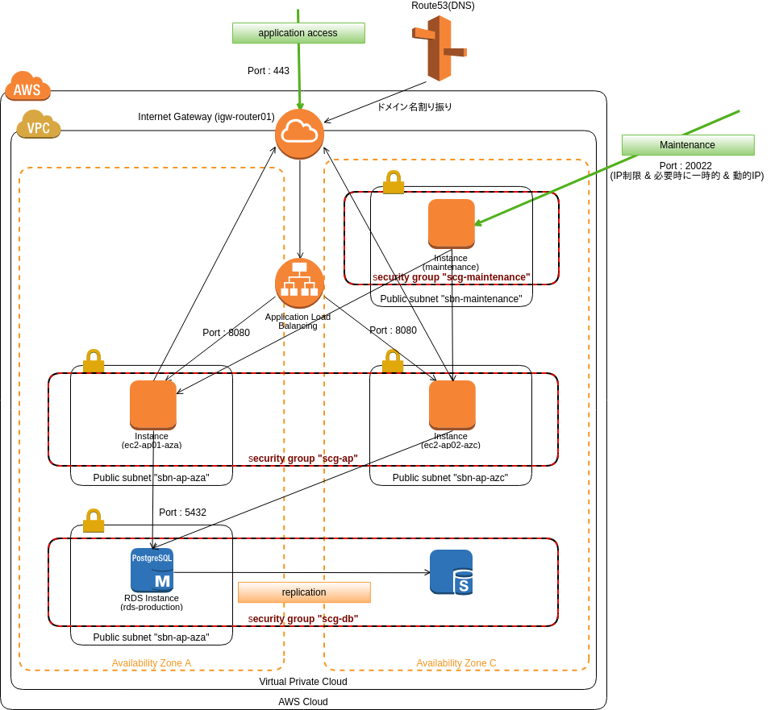

AWS Teppan Stracture
====================

# What's this?

俗にAWSな人の言う「鉄板構成」をTerraformでAsCodeしたものです。

# Overview

# Known Issues / Improvement

- 旧態然とした「メンテナンス用インスタンス」を置いている
  - 非効率だが「類型的に奏していることも多い」ので、サンプルとしては配置してみている
  - 「最低限のライフライン」として、用意していることも多い
    - 実運用じゃ止めててもよい
  - 本来で行くと「Run command」などでメンテンナンスするのが望ましい
    - 少し込み入ったことや、ファイルを取るなど「ローカルとひも付きが強い作業」がある場合はそうも行かないので

# Prerequisite

前提として、以下の設定はすでに行っていることとします。

- 手動で作成済み
  - ACLにて「ドメインの証明書」
  - EC2インスタンス用のキーペア
- EC2の「プロビジョニング」は「別途行う」or「ゴールデンイメージ」想定
  - どちらでも行けるように「AMIのIDは設定ファイルに外だしシてある」
